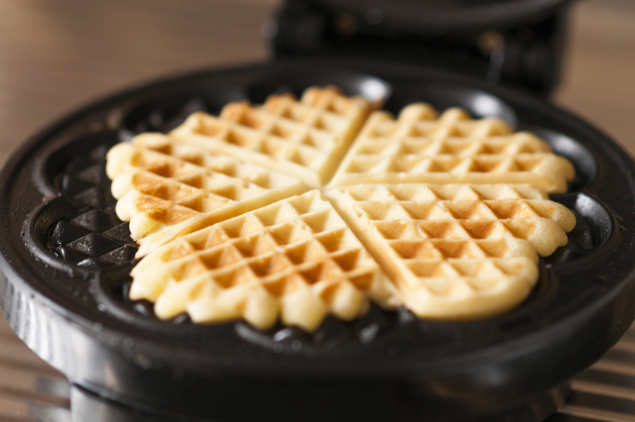

# Recept voor Wafels
##### Door Kaj Linthorst

## Equipment

Wafelijzer
## Ingrediënten

250 milliliter melk op kamertemperatuur

250 gram zelfrijzend bakmeel

0,5 theelepel baksoda
snufje zout

2 eieren + 1 eidooier extra

100 gram gesmolten roomboter

100 gram suiker voor dit recept gebruik ik gewoon kristalsuiker

1 zakje vanillesuiker

## Instructies

Meng het zelfrijzend bakmeel met 0,5 tl baksoda.

Mix de eieren in lege kom luchtig. (de kleur moet lichtgeel van kleur worden) 

Voeg de suiker, vanillesuiker en een snufje zout toe en mix nog voor 1 minuut.

Mix dan langzaam de gesmolten roomboter en de melk erdoorheen. 

Voeg het zelfrijzend bakmeel toe en spatel/mix dit door het beslag. (niet te lang mixen)

Verwarm je wafelijzer op 190 graden. Het beslag kan nu even rusten.

Wanneer je wafelijzer warm is, vet dan de wafelijzer in met een beetje zonnebloemolie. 

Schep 1 soeplepel (ongeveer 3 flinke el) beslag in het midden van de vorm. 

Doe de wafelijzer dicht en bak de wafels in ongeveer 1,5 minuut gaar en goudbruin.

Serveer de wafels wanneer ze nog warm zijn….dan zijn ze het lekkerst.

*TIP: per wafelijzer kan het verschillen hoe lang de wafels moeten bakken. Het kan dus zomaar zijn dat jouw wafels misschien wel 3 à 4 minuten moeten bakken.*